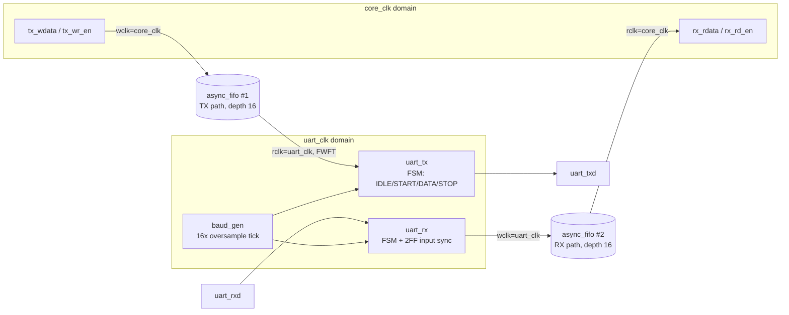

<div align="center">

# UART Controller with Async-FIFO Clock-Domain Crossing

<p>


</p>

<p>


</p>

A UART transmitter/receiver (fixed 8N1) whose TX and RX data paths are each
buffered by an instance of my existing
[Asynchronous FIFO](https://github.com/Soureesh09/Asynchronous-FIFO-using-gray-code) --
reused exactly as already verified, unmodified, as the clock-domain
crossing between a core clock domain and an independent UART clock domain.

</div>

---

## Why a FIFO belongs here at all

A UART's bit timing is locked to a baud rate, which is normally derived
from whatever clock the UART peripheral runs on. In a real SoC that
peripheral clock is very often a *different* clock than the core/CPU
clock feeding it bytes -- they're related only through a shared reset,
not a shared clock edge. Something has to safely move a byte from "the
core just decided to send this" to "the UART peripheral clock domain is
ready to serialize this," and the standard answer to *any* two-independent-
clocks handoff is a dual-clock FIFO with Gray-coded pointers. That's
exactly what the existing async FIFO project already is, so this project
reuses it twice -- once per direction -- instead of inventing a new CDC
scheme.

## Architecture



Both `async_fifo` instances are **FWFT** (first-word-fall-through): their
`rdata` output is already valid combinationally the instant the FIFO
isn't empty, so popping a word and consuming it happen on the very same
clock edge everywhere in this design -- there's no extra "wait a cycle
after asserting `rd_en`" logic anywhere.

## Module breakdown

| File | Language | Role |
|---|---|---|
| `rtl/fifo/*.v` | Verilog | The existing async FIFO project, copied in **unmodified** |
| `rtl/baud_gen.sv` | SystemVerilog | Divides `uart_clk` down to a 16x-oversample tick |
| `rtl/uart_tx.sv` | SystemVerilog | Serializes a byte into an 8N1 frame (IDLE/START/DATA/STOP FSM) |
| `rtl/uart_rx.sv` | SystemVerilog | Recovers a byte from an 8N1 frame, sampling each bit at its midpoint |
| `rtl/uart_fifo_top.sv` | SystemVerilog | Wires two `async_fifo` instances around the UART logic |
| `tb/tb_uart_tx.sv` | SystemVerilog | Unit test: independent bit-bang checker of `uart_tx`'s serial output |
| `tb/tb_uart_rx.sv` | SystemVerilog | Unit test: independent bit-bang driver of `uart_rx`, plus a bad-stop-bit case |
| `tb/tb_uart_fifo_top.sv` | SystemVerilog | System test: real TX+RX loopback through both FIFOs, unrelated clocks |

Fixed format throughout: **8 data bits, no parity, 1 stop bit ("8N1")**,
LSB-first -- the standard, near-universal UART framing.

## How the receiver actually decodes a bit 

`uart_rx`'s input arrives from a genuinely different clock domain (or off-chip
entirely), so it can transition at *any* point relative to `uart_clk` --
there's no guarantee a bit's edge lines up with anything. Sampling once,
right on that unpredictable edge, is asking for trouble. The standard fix,
used here, is **16x oversampling**: `baud_gen` produces a tick 16 times per
bit period instead of once, and `uart_rx` counts to the 7th/8th tick --
*the middle* of the bit -- before trusting the value. A start bit that's a
little jittery, or a receiver that's a few nanoseconds out of phase with
the transmitter, still gets sampled well clear of either edge. `uart_tx`
uses the same 16-tick period per bit purely so both ends agree on timing;
it doesn't need to sample anything, so it just counts to 16 and moves on.

## Verification

Three layers, each proven independently before trusting the next:

1. **`tb_uart_tx`** -- an independent bit-bang *receiver* (written from
   scratch, not by reusing `uart_rx`) decodes 60 back-to-back random
   frames off `uart_tx`'s serial output and checks every byte and the
   stop bit.
2. **`tb_uart_rx`** -- an independent bit-bang *driver* (not reusing
   `uart_tx`) pushes 60 back-to-back random frames plus one deliberately
   malformed frame (bad stop bit) onto `uart_rx`, checking every decoded
   byte and that `frame_error` fires exactly when it should.
3. **`tb_uart_fifo_top`** -- the real `uart_tx` and `uart_rx` talking to
   each other through an actual serial loopback wire, with the two FIFOs'
   clock domains deliberately unrelated (10 ns / 7 ns periods -- the same
   "genuinely asynchronous" spirit as the original FIFO testbench's 10 ns
   / 6 ns), driven with randomized bursts and gaps against a software
   reference queue, the same self-checking style as the FIFO project.

Each module's unit test was written to be checkable *independently* of
the other -- `tb_uart_tx` never instantiates `uart_rx` and vice versa --
specifically so a bug in one couldn't hide or fake-fix a bug in the other.
Only the system test exercises the real pair together.

## Verification Results

Three self-checking testbenches were used to verify the design independently
at the module and system levels.

### UART TX Verification

The transmitter is tested using an independent bit-bang receiver that decodes
the generated 8N1 serial frames and checks the transmitted data and stop bit.


**60/60 frames passed — 0 mismatches.**

### UART RX Verification

The receiver is tested using an independent bit-bang UART driver. In addition
to valid frames, a malformed stop-bit frame is injected to verify error
detection.


**60/60 valid frames passed — malformed stop bit detected correctly.**

### Full-System Loopback

The complete UART controller is tested by connecting TX directly to RX through
the serial loopback path. Both asynchronous FIFOs and their clock-domain
crossings are exercised using unrelated clock domains.


**60/60 bytes transferred successfully — 0 mismatches, no overflow, no frame
errors.**

**A bug this process actually caught:** the first version of the
integration testbench's own driver had a classic testbench race --
checking `tx_fifo_full` immediately after a clock edge, before that
edge's own register update (from the *previous* write) had settled,
occasionally let a write slip through into an already-full FIFO one
cycle later than intended. The fix was sampling `tx_fifo_full` a hair
(`#1`) after the clock edge, never right at it. Left in the testbench's
comments as a worked example, since it's a genuinely common class of
mistake, not a one-off.

**Scoped out for now:** an `assert property`-based backpressure check was
attempted in the integration testbench but pulled back out -- correctly
aligning its own sampling to the FIFO's one-cycle-registered `full` flag
needed more cycle-accurate care than this pass justified, especially
since the scoreboard above already proves zero data loss end-to-end by
construction. A clean follow-up would be re-deriving that assertion (or
just using `$past(tx_fifo_full)`) once there's time to verify it against
a dedicated fill-to-capacity directed test. `rx_fifo_overflow` and
`rx_frame_error` are implemented and exposed at the top level but only
lightly exercised (the loopback test never overflows, by construction,
and only the RX unit test drives a bad frame) -- directed overflow and
multi-error-injection tests are the natural next extension, the same way
the FIFO project's SVA-based class environment was an extension on top of
its own core self-checking testbench.

## Simulation vs. synthesis defaults

`CLK_FREQ_HZ = 100_000_000` and `BAUD_RATE = 115_200` are `uart_fifo_top`'s
defaults, matching the FIFO project's own 100 MHz reference and the most
common UART baud rate. `baud_gen` computes its divisor with **integer**
division, so the realized rate is very slightly off:

```
DIVISOR = 100_000_000 / (115_200 x 16) = 54          (truncated from 54.25)
actual baud = 100_000_000 / (54 x 16)  = 115,740.7    (+0.47% vs. 115200)
```

Well inside the ~2% a real UART link tolerates. The integration testbench
uses a genuinely different `uart_clk` (7 ns / ~142.857 MHz) than
`core_clk` (10 ns / 100 MHz) specifically to exercise the CDC, recomputing
its own divisor to match.

## Repository structure

```
uart-fifo-controller/
├── rtl/
│   ├── fifo/                  # existing async FIFO, unmodified (Verilog)
│   │   ├── async_fifo.v
│   │   ├── fifo_mem.v
│   │   ├── sync_2ff.v
│   │   ├── wptr_handler.v
│   │   └── rptr_handler.v
│   ├── baud_gen.sv
│   ├── uart_tx.sv
│   ├── uart_rx.sv
│   └── uart_fifo_top.sv
├── tb/
│   ├── tb_uart_tx.sv
│   ├── tb_uart_rx.sv
│   └── tb_uart_fifo_top.sv
├── sim/
│   ├── run_icarus.sh          # free, cross-platform sanity check
│   └── run_vivado.bat         # xvlog / xelab / xsim, matches the HOLY_CORE flow
├── constraints/
│   └── uart_fifo.xdc          # async clock groups + placeholder pin LOCs
└── README.md
```


## License

MIT -- see [LICENSE](LICENSE).
